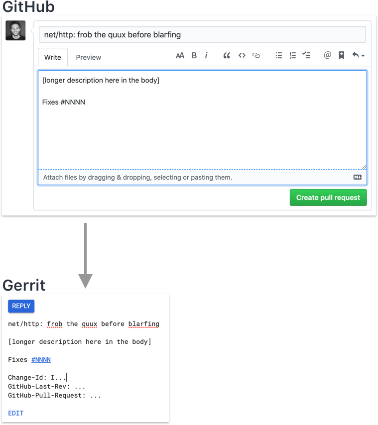

# Commit messages

Commit messages, also known as CL (changelist) descriptions, should be formatted per https://go.dev/doc/contribute#commit_messages. For example,

```
net/http: handle foo when bar

[longer description here in the body]

Fixes #nnnn
```

Notably, for the subject (the first line of description):

* the name of the package affected by the change goes before the colon
* the part after the colon uses the verb tense + phrase that completes the blank in, *"this change modifies Go to ___________"*
* the verb after the colon is lowercase
* there is no trailing period
* it should be kept as short as possible (many git viewing tools prefer under ~76 characters, though Go isn't super strict about this).

For the body (the rest of the description):

* the text should be wrapped to ~76 characters (to appease git viewing tools, mainly), unless you really need longer lines (e.g. for ASCII art, tables, or long links)
* the Fixes line goes after the body with a blank newline separating the two
* there is **no** Markdown in the commit message
* we **do not** use `Signed-off-by` lines. Don't add them. Our Gerrit server & GitHub bots enforce CLA compliance instead.
* when referencing CLs, prefer saying "CL nnn" or using a golang.org/cl/nnn shortlink over a direct Gerrit URL or git hash, since that's more future-proof.
* when moving code between repos, include the CL, repository name, and git hash that it was moved from/to, so it is easier to trace history/blame.

Please _don't_ use alternate GitHub-supported aliases like `Close` or `Resolves` instead of `Fixes`.

To link a commit to an issue without marking it fixed—for example, if the commit is working toward a fix but not yet a complete fix—GitHub requires only that the issue is mentioned by number in the commit message. By convention, Go commits mention this at the bottom of the message using `For`, where `Fixes` might be expected, even if the number is also mentioned in the body of the commit message.

For example:

```
Refactor func Foo.
This will make the handling of <corner case>
shorter and easier to test.

For #nnnn
```

It is common in other Git projects to use `Updates` instead of `For`, and that is acceptable too, even though it makes little sense (the commit does not update the issue). More precise phrasings are fine too. Don't be too pedantic in code reviews: it's not worth asking people to change from `Updates` or something else to `For`, or vice versa.

# Reverts

You can roll back a change using the Gerrit `Revert` button.
Gerrit will generate a description for you.
Edit the description to add the Gerrit CL number being rolled back next to or instead of the Git revision number.

Do not use the Gerrit UI to create a revert of a revert, as that notifies people right away.
Instead, mail it as a new change, and in the description explain that it is a roll forward of CL NNNNNN which was rolled back by CL NNNNNN.

# Other repos

For non-"go" repos ("crypto", "tools", "net", etc), the subject is still the name of the package, but you need to fully-qualify the issue number with the GitHub org/repo syntax:

```
cipher/rot13: add new super secure cipher

Fixes golang/go#1234
````

Notably, the first line subject should **not** contain the `x/crypto/` prefix. We only do that for the issue tracker.

# Non-normative references

- [Please heed my plea and write good CL descriptions for Go—and for any other project you work on.](https://groups.google.com/d/msg/golang-dev/6M4dmZWpFaI/SyU5Sl4zZLYJ)
- [The CL description is a public document that explains to the future what has been done and why.](https://groups.google.com/d/msg/golang-dev/s07ZUR8ZDHo/i-rIsknbAwAJ)

# GitHub Pull Requests

If you're using GitHub Pull Requests, your commit message is constructed by GerritBot based on your
PR's title & description. See https://go.dev/wiki/GerritBot#how-does-gerritbot-determine-the-final-commit-message.

If somebody asks you to modify your commit message, you'll need to modify your PR.

