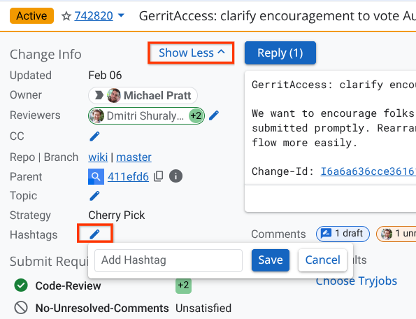
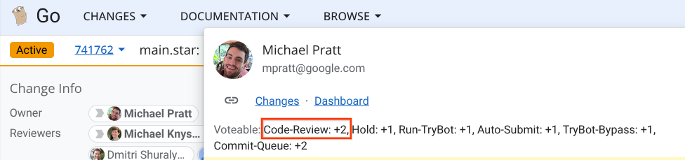

There are two types of Gerrit access described here, with different powers & responsibilities. Only ask for access if you're an active member of the community. New contributors should participate in the Gerrit code review process for some time before requesting access.

(For GitHub access, see [GitHubAccess](/wiki/GitHubAccess))

## Running TryBots ("may-start-trybots")

TryBot access lets you kick off a test run of a CL in Gerrit prior to submission (pre-submit testing).
TryBots run in a somewhat-secure and somewhat-isolated environment,
but they're not perfectly security hardened.
You must skim the CL for anything malicious before starting TryBots.

See [LUCI](/wiki/LUCI#TryBots) for details on triggering TryBots.

All approvers (see next section) have TryBot access automatically. Others can request TryBot access. See [Requesting Access](#requesting-access) below.

## Approving CLs ("approvers")

Approvers can review and submit code changes (CLs), subject to the review rules described below.
Being an approver comes with an expectation of responsibility: approvers are people who care about Go and want to help it succeed.
An approver is not just someone who can make changes, but someone who has demonstrated their ability to collaborate with the team, get the most knowledgeable people to review code, contribute high-quality code, and follow through to fix issues (in code or tests).

To request approver access, see [Requesting Access](#requesting-access) below.

### Submit Requirements

Before a CL can be submitted, it must meet several _Submit Requirements_, which enforce our code review guidelines.
Gerrit displays the satisfied and unsatisfied submit requirements in the "Submit Requirements" section in the upper left corner of the CL page.
Hovering over each requirement displays additional information about the requirement.

The most important and prominent requirements include:

- "Code-Review": Each CL must be approved with at least one Code-Review+2 vote from an approver.
The CL owner cannot approve their own CL.
Requiring multiple people ensures that code cannot be submitted unilaterally from a single compromised account.

- "No-Unresolved-Comments": CLs must not have any unresolved code review comments.

- "TryBots-Pass": Each CL must pass [LUCI TryBots](/wiki/LUCI#TryBots).

- "Review-Enforcement": Each CL requires the involvement of at least two Google employees using Google-secured computers, either as CL owner or as a reviewer voting at least Code-Review+1.
The Google employee and hardware requirements further raise the bar: since CLs in many repos are essentially published by Google for download by users at commit time, the Google involvement is to approve this publication.
Note that the Go Team at Google monitors a [dashboard](/s/needs-review) for CLs that meet all requirements except this one.

Some less common code review controls mentioned below (such as Hold+1) are also enforced with submit requirements, but these will not appear on Gerrit unless used.

Once a change satifies all submit requirements, a Submit button appears in Gerrit (for approvers).
Approvers can submit any CL, but generally you should only submit changes with a Code-Review+2 from the owner of that area (maybe you!).

### Code Review

Code review is the most important part of the CL process.
Multiple people iterate back and forth on a change to ensure a high-quality result.
Once a CL is in a satisfactory state, reviewers use the Code-Review label to indicate approval.

A Code-Review+1 vote means that you have read the change and believe it seems reasonable but aren’t making the definitive judgement that Code-Review+2 indicates.
It also means you are confident the change does not introduce any sort of security vulnerability or other clearly inappropriate code change.
Note that Code-Review+1 votes are optional, as they have no effect on [submit requirements](#submit-requirements) except for Google employee votes for "Review-Enforcement".

A Code-Review+2 vote means that you have read the change and are confident that it is correct and appropriate to submit.

Typically, you should only Code-Review+2 code in directories or packages that you "own"; the exception is trivial and obviously correct changes.

Note that all user-visible new features or changes—new exported API, new command-line flags, and so on—need to go through the [proposal process](/s/proposal-process).
The CLs should reference the specific accepted proposal [in the commit message](/wiki/CommitMessage) (“For #NNN.”).

If a CL should not be submitted, you can indicate this with one of:

- Leave one or more unresolved comments.
CLs cannot be submitted until all unresolved comments are marked as resolved.

- Vote Hold+1.
Review can continue, but the CL cannot be submitted until the Hold+1 is manually removed.
This is stronger than an unresolved comment at ensuring the CL is not submitted accidentally.
A typical reason to use Hold+1 would be for changes that need to wait for proposal review before submission.

- [Add](#add-hashtags) the "wait-release" hashtag.
Use this hashtag for changes that should not be submitted during an ongoing [release freeze](/wiki/Go-Release-Cycle).
This hashtag is removed automatically when the tree unfreezes.

If the author did not already trigger TryBots, we encourage voting Commit-Queue+1 along with your review, as the author may not have permission to trigger tests.
Getting feedback from tests is often valuable even if you are not yet approving the CL with Code-Review+2.

Once the CL is approved, it must be submitted. Approvers can submit their own CLs, but all other contributors require an approver to submit on their behalf.
If you are unsure if the author is an approver, you can [find out in the Gerrit UI](#check-approvers).

We don't want changes to get forgotten; stuck with all submit requirements satisfied, simply waiting for someone to click Submit.
Thus, when adding a Code-Review+2 vote on a change from a non-approver, we encourage [voting Auto-Submit+1](#auto-submit) (or directly clicking Submit) unless you have a specific reason you believe the change should not be submitted immediately.
For example, perhaps the change looks good, but it should wait until after another potentially-conflicting CL is submitted.
If you don't want the change submitted immediately, please make the reason clear to the author and other reviewers, such as with an unresolved comment or Hold+1 vote.

### Auto-Submit

If you are reviewing a CL and believe it can be approved and submitted as is, with no further changes, you can use the auto-submit functionality to submit the CL when ready.

To do this, vote Code-Review+2 as well as Auto-Submit+1. If TryBots are not already running or previously completed, also vote Commit-Queue+1.
When the tests pass, Gopherbot will submit the CL.

More precisely, Gopherbot watches for and automatically submits CLs that

- have an Auto-Submit+1 vote,
- have a satisfied TryBots-Pass submit requirement,
- have the necessary code reviews,
- have no unresolved comments,
- aren't marked #wait-release,
- and merge cleanly into the current branch head.

All approvers can add Auto-Submit+1 votes.
An Auto-Submit+1 vote is not carried forward when a patch is reuploaded.

## Approving Wiki CLs ("wiki-approvers")

People who work mainly in the wiki (https://go.googlesource.com/wiki) can request wiki-approvers permission. This lets them +2 and submit wiki CLs, even their own CLs. Wiki CLs do not require the involvement of two (or any) Google employees, they have no TryBots, and they can be self-reviewed.

# Requesting Access

To request any of the access types above, file a new issue (https://go.dev/issue/new?title=access:+&body=See+https://go.dev/wiki/GerritAccess.) and state which access you want, and state the Google account you use to log in to Gerrit.

Decisions about granting access are made by the Go release team at Google. If your request is declined, it is almost always because you haven't been active enough for them to get a clear enough signal about your work, understanding of project conventions, and so on. Don't lose heart: it can take time to reach that level of familiarity.

## Once you have access

Go help garden! See [Gardening](/wiki/Gardening).

# Appendix

## Add Hashtags

To add a hashtag, like "wait-release", first click the "Show All" button at the top left of the page, and then the edit button next to "Hashtags".

## Check approvers

To check if a CL owner is an approver (and thus able to submit their own CLs), hover over their name chip.
If the "Voteable" section shows "Code-Review+2", then they are an approver.

BUG: As of this writing, Gerrit has an intermitent bug where the "Voteable" section is missing entirely.
If you see that, you need to check the user on another unsubmitted CL (Code-Review is never voteable on submitted CLs).

