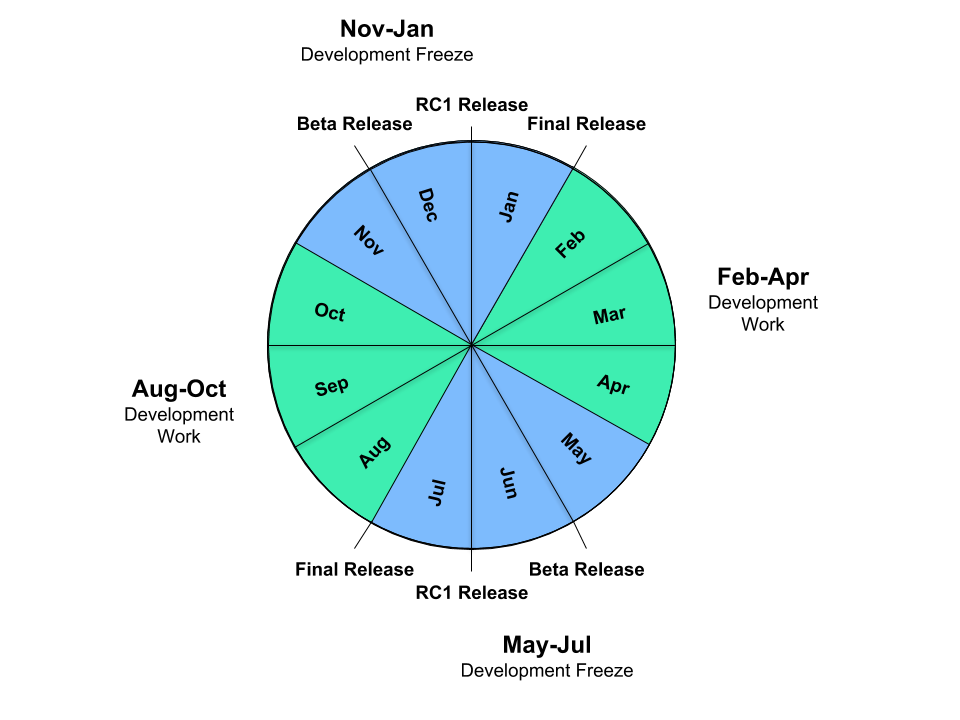

This wiki page is maintained by the Go team.
Please [send comments to golang-dev](TODO://LINK)
or [file issues](https://golang.org/issue) instead of making changes directly.

Short link: https://golang.org/s/release.

## Overview

After fourteen months elapsed between Go 1.0 and Go 1.1, the Go team
adopted a release schedule to streamline the process of working on,
finishing, and issuing releases.
The overall goal is to make a major release every six months, which breaks down into 
three months of general development followed by three months of testing and polishing
known as the release freeze.
A release is maintained by issuing minor releases to correct
critical problems such as crashes or security issues.

Note that this page documents what we intend to do for upcoming releases.
If you are familiar with what we have done in the past,
pay particular attention to the differences described in the
[history section](#history).

## Timeline

The current release cycle is aligned to start on February 1 and August 1 of each year.
The target milestones for a release cycle are as described below.
We try to hit the targets as closely as possible, while still delivering
a quality release.

Betas, release candidates, and releases have traditionally been cut and issued
mid-week, often on Wednesdays.
We avoid Mondays to give the Go team a work day before to prepare for the cut,
and we avoid Fridays to give the Go team a work day after in case the cut runs
into unexpected problems.

#### January 15 / July 15: Planning for release begins.

Planning of major work for upcoming release cycle is announced
on [golang-dev](https://groups.google.com/group/golang-dev).

Examples: 
[Go 1.4](https://groups.google.com/d/msg/golang-dev/eqBihsj7x-k/3h59pc8FDAoJ),
[Go 1.5](https://groups.google.com/d/msg/golang-dev/2ZUi792oztM/GNsw1i76LhsJ),
[Go 1.6](https://groups.google.com/d/msg/golang-dev/vNboccLL95c/XOD3vHKOCQAJ).

#### February 1 / August 1: Release work begins.

This milestone is delayed if the previous release has not yet been issued,
but note that later milestones are not delayed.
That is, failure to get one release out on time takes time away from
the development cycle of the subsequent release.

Note that incoming bug reports should be handled and bugs fixed during 
ordinary release work.
It is not appropriate to leave all bug fixes for the release freeze.
See the [history](#history) section for more discussion.

#### May 1 / November 1: Release freeze begins.

This milestone begins the second half of the release cycle, the release freeze.
The release freeze applies to the entire main repository
as well as to the code in subrepositories that is needed to build the
binaries included in the release,
particularly godoc and all its dependencies in the tools subrepository.

Changes that were mailed before the freeze can be submitted
if they are reviewed promptly after the freeze begins.
During the freeze, only bug fixes and doc updates are accepted.
On occasion new work may be done during the freeze, but only in exceptional circumstances
and typically only if the work was proposed and approved before the cutoff.
Such changes must be low risk.

This part of the release cycle is focused on improving the quality of the release,
by testing it and fixing bugs that are found.
However, every fix must be evaluated to balance the benefit of a possible fix
against the cost of now having not as well tested code (the fix) in the release.
Early in the release cycle, the balance tends toward accepting a fix.
Late in the release cycle, the balance tends toward rejecting a fix,
unless a case can be made that the fix is both low risk and high reward.

Examples of low risk changes appropriate late in the cycle include changes
to documentation and fixes to new features being introduced in the current
release (since there is no chance of introducing a regression compared to
an earlier release).

By the end of the first month of the freeze, nearly all known bugs
should have been fixed or explictly postponed (either to the next
release or indefinitely). There should be few known bugs left,
perhaps only the ones that have proven too elusive to chase down.

#### June 1 / December 1: Beta 1 issued.

A beta release is meant to encourage testing to discover new bugs.
Issuing a beta is an indication that the Go team has fixed nearly all the
known bugs that are planned to be fixed for the release,
and now it is time to look for as yet unknown bugs.

The first beta includes a complete draft of the eventual release notes,
but marked clearly as a draft to avoid confusion when people link
to them on the internet.

If a release is ahead of schedule, it is acceptable and even encouraged
to issue a beta a few weeks ahead of this target.

As bugs are reported and fixed, additional betas may be released,
provided there are significant code changes to test anew.
Typically betas should not be issued more frequently than two weeks.
It is important not to issue too many betas, nor too many release candidates:
we are asking our users for their time to help us test the release
and must not waste their good will by making too many requests.

A beta is not expected to be bug-free and should not be used in
production settings where failures or misbehavior cannot be tolerated.
Organizations can run integration or other tests against a beta
or even use it in a canary setting, but they should be discouraged from
deploying the beta for unrestricted production usage.

#### July 1 / January 1: Release candidate 1 issued.

A release candidate is meant to be as close as possible to the actual release bits.
Issuing a release candidate is an indication that the Go team has high confidence
that the tree is free of critical bugs.

Once a release candidate is issued, only documentation changes
and changes to address critical bugs should be made.
In general the bar for bug fixes at this point is even slightly higher than the
bar for bug fixes in a minor release.
We may prefer to issue a release with a known but very rare crash
than to issue a release with a new but not production-tested fix.

If a release is ahead of schedule, it is acceptable and even encouraged
to issue a release candidate a few weeks ahead of this target.
Extended release testing is a great way to deliver a robust release. 

If critical bugs are reported and fixed, additional release candidates may be issued,
but typically not more than one every two weeks.

Again, a release candidate is meant to be bug-free, as much as possible.
Organizations are encouraged to deploy it in production settings
after appropriate organization-specific testing.

One of the criteria for issuing a release candidate is that
Google be using that version of the code for new production builds
by default: if we at Google are not willing to run it for production use,
we shouldn't be asking others to.
We may issue the release candidate a few days in advance of Google
changing over, depending on how the calendar falls.
For example, the change inside Google makes more sense to do on Mondays,
so we may issue the release candidate the Wednesday before
or the Wednesday after Google converts to the new release by default.

The calm period between a release candidate and the final release
is a good time for additional testing or for discussing the next release
(see the January 15 milestone above).

#### August 1 / February 1: Release issued.

Finally, the release itself!

A release should not contain significant changes since the last release candidate:
it is important that all code in the release has been well tested.
Issuing a release is an indication that release testing has confirmed
the release candidate's high confidence that the tree is free of critical bugs.

One of the criteria for issuing a release is that the release candidate
has been available for four weeks and any problems that need to be
addressed have been.

If a release process has run ahead of schedule, with an early beta
and early release candidate,
release candidate testing should absorb any extra time,
leaving the actual release on time, not early.
This improves the stability of the release, and it also gives developers
working on the Go release more time to think about and plan the
next release before code changes start pouring in again.

If a release is behind schedule, it is acceptable (but certainly not ideal)
to issue a release sooner than four weeks after the release candidate,
but no sooner than two weeks after.
Abbreviated release testing is a great way to deliver a buggy release.

Because Google runs the release candidate as the default
version of Go, four weeks of release testing means that
at the least Google has been using this version of Go for
four weeks before it becomes an official release.
While Google's successful use does not guarantee the
absence of problems, our experience has been that
it certainly helps improve the quality of the release.
We strongly encourage other organizations to test release candidates
as aggressively as they are able and to report problems that they find.

Once a release is issued, work on the next release, including code reviews
and submission of new code, can begin, and the cycle repeats.
Note that if a release is delayed, so is work on the next release.

## Release Maintenance

A minor release is issued to address one or more critical problems
for which there is no workaround (typically related to stability or security).
The only code changes included in the release are the fixes for the specific 
critical problems.
Important documentation-only changes and safe test updates (such as disabling tests), may also be included as well,
but nothing more.

Minor releases to address non-security problems for Go 1.x stop once Go 1.x+1 is released.

Minor releases to address security problems for Go 1.x stop once Go 1.x+2 is released.
For more about security updates, see the [security policy](https://golang.org/security).

See also https://github.com/golang/go/wiki/MinorReleases.

## History

The Go release cycle was discussed and adopted
after the fourteen month effort to release Go 1.1.
Go 1.2, Go 1.3, and Go 1.4 followed a six-month cycle
beginning and ending (alternately) on December 1 and June 1.
After experience with calendar problems in that cycle,
we extended Go 1.5's development phase by two months
to shift the cycle to begin and end on February 1 and August 1,
as described above.

The [original proposal](https://golang.org/s/release-old)
did not contain enough detail about the milestones during the freeze,
and over the course of a few releases development work took over
much of the freeze.
Compared to the goal set above of issuing a beta one month
into the release freeze, the first betas for Go 1.3, Go 1.4, Go 1.5,
and Go 1.6 were three, four, five, and six weeks late, respectively.
(Go 1.6 beta 1 was only two weeks late, but it was
full of known bugs that we still intended to fix,
primarily to get something out for testing before the winter holidays.
Go 1.6's first real beta by the above definition was beta 2.)

When the beta is late, everything that follows the beta—shaking out
the final bugs, thorough testing of the release candidates,
and the shipping of the release—gets rushed, leading to more bugs
in the final release and usually a delay in starting the next cycle.

The beta was ready later and later in those four cycles primarily
because we both postponed too many bugs to the freeze
and then allowed too many non-essential bug fixes during the freeze.

For Go 1.7 and later we will need to make sure that bugs are fixed
before the freeze.
That is, we need to follow the schedule above, not what we've done in the past.
